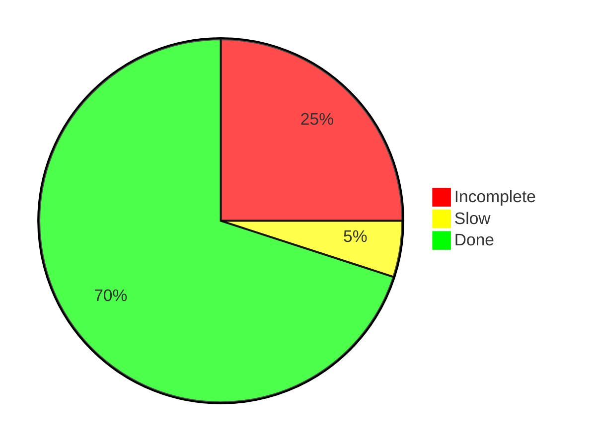

# Advent of Code solutions in Java

Author: Anders Birk Sørensen
Email: anders@ablok.dk

This repository contains my solutions for AoC 2019, 2021 and 2022 written in Java. My solutions for 2021 were done in
LabVIEW and can be found here.

All solutions can be compiled and run using Java 17.

## Running

All solutions can called by running the test classes in src/dk/ablok/aoc/test/.

For the IntCode puzzles (2019) in particular, the test classes will disable visualizations for speed. To run them with
visualizations, toggle the call to disableDisplay() in assertIntcodePuzzle().

## Structure

The code for each puzzle solution is kept in a single file except for common utilities. The puzzles implement a common 
interface to make testing easier.

## Notes

## Current progress

|                 | 2019       | 2021       | 2022       | 2023       |
|-----------------|------------|------------|------------|------------|
| 1               | Done       | Done       | Done       | Done       | 
| 2               | Done       | Done       | Done       | Done       | 
| 3               | Done       | Done       | Done       | Done       | 
| 4               | Done       | Done       | Done       | Done       | 
| 5               | Done       | Done       | Done       | Done       | 
| 6               | Done       | Done       | Done       | Done       | 
| 7               | Done       | Done       | Done       | Done       | 
| 8               | Done       | Done       | Done       | Done       | 
| 9               | Done       | Done       | Done       | Done       | 
| 10              | Done       | Done       | Done       | Done       | 
| 11              | Done       | Done       | Done       | Done       | 
| 12              | Done       | Done       | Done       | Done       | 
| 13              | Done       | Done       | Done       | Done       | 
| 14              | Done       | Done       | Done       | Slow       | 
| 15              | Done       | Slow       | Slow       | Incomplete | 
| 16              | Incomplete | Done       | Incomplete | Incomplete | 
| 17              | Done       | Done       | Slow       | Incomplete | 
| 18              | Done       | Done       | Done       | Incomplete | 
| 19              | Incomplete | Incomplete | Incomplete | Done       | 
| 20              | Done       | Done       | Done       | Incomplete | 
| 21              | Done       | Done       | Done       | Incomplete | 
| 22              | Done       | Incomplete | Incomplete | Incomplete | 
| 23              | Incomplete | Incomplete | Done       | Incomplete | 
| 24              | Done       | Incomplete | Incomplete | Incomplete | 
| 25              | Done       | Done       | Done       | Slow       | 
|                 |            |            |            |            |
| Incomplete      | 3          | 4          | 4          | 9          |
| Solved but slow | 0          | 1          | 2          | 2          |
| Done            | 22         | 20         | 19         | 14         |

## Refactoring projects for when I have time
* A common, general purpose 2D class with methods for adding, subtracting and rotating. 
* Flood-fill algorithm with functional interfaces to calculate information along the way and predicate for stop condition
  * Refactor previous puzzles to use this for flood-fill and BFS 
* Use LeastCommonMultiple class for previous years' puzzles that require it
* Refactor all puzzles to use the new AocInput class so the input file path is not hard-coded into the testsuite
* Add javadocs header to all puzzles
* Have unsolved puzzles throw an exception instead of returning null or an empty string