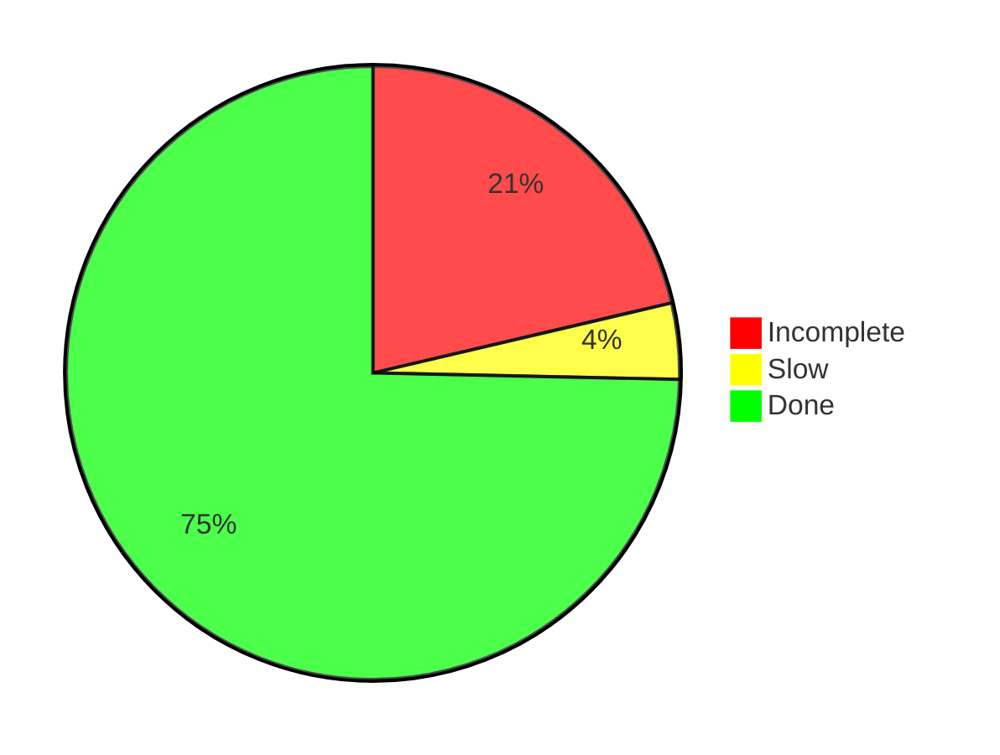

# Advent of Code solutions in Java

Author: Anders Birk Sørensen
Email: anders@ablok.dk

This repository contains my solutions for AoC 2019, 2021 and 2022 written in Java. My solutions for 2021 were done in
LabVIEW and can be found here.

All solutions can be compiled and run using Java 17.

## Running

All solutions can called by running the test classes in src/dk/ablok/aoc/test/.

For the IntCode puzzles (2019) in particular, the test classes will disable visualizations for speed. To run them with
visualizations, toggle the call to disableDisplay() in assertIntcodePuzzle().

## Structure

The code for each puzzle solution is kept in a single file except for library classes. The puzzles generally extend a
common puzzle solution class

## Notes

## Current progress

|                 | 2019       | 2021       | 2022       |
|-----------------|------------|------------|------------|
| 1               | Done       | Done       | Done       | 
| 2               | Done       | Done       | Done       | 
| 3               | Done       | Done       | Done       | 
| 4               | Done       | Done       | Done       | 
| 5               | Done       | Done       | Done       | 
| 6               | Done       | Done       | Done       | 
| 7               | Done       | Done       | Done       | 
| 8               | Done       | Done       | Done       | 
| 9               | Done       | Done       | Done       | 
| 10              | Done       | Done       | Done       | 
| 11              | Done       | Done       | Done       | 
| 12              | Incomplete | Done       | Done       | 
| 13              | Incomplete | Done       | Done       | 
| 14              | Done       | Done       | Done       | 
| 15              | Done       | Slow       | Slow       | 
| 16              | Incomplete | Done       | Incomplete | 
| 17              | Done       | Done       | Slow       | 
| 18              | Incomplete | Done       | Done       | 
| 19              | Incomplete | Incomplete | Incomplete | 
| 20              | Done       | Done       | Done       | 
| 21              | Done       | Done       | Done       | 
| 22              | Incomplete | Incomplete | Incomplete | 
| 23              | Incomplete | Incomplete | Done       | 
| 24              | Incomplete | Incomplete | Incomplete | 
| 25              | Done       | Done       | Done       | 
|                 |            |            |            |
| Incomplete      | 8          | 4          | 4          |
| Solved but slow | 0          | 1          | 2          |
| Done            | 17         | 20         | 19         |

